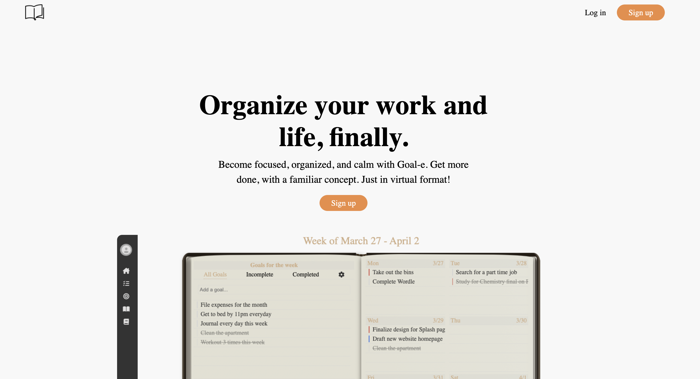
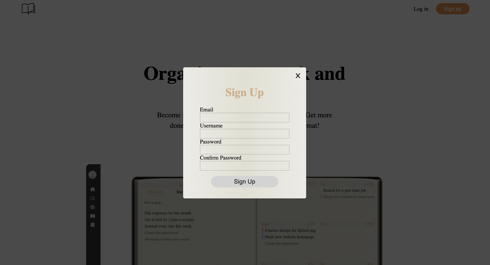
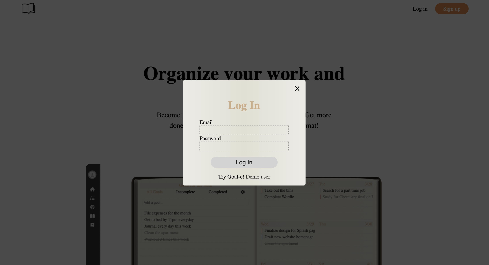
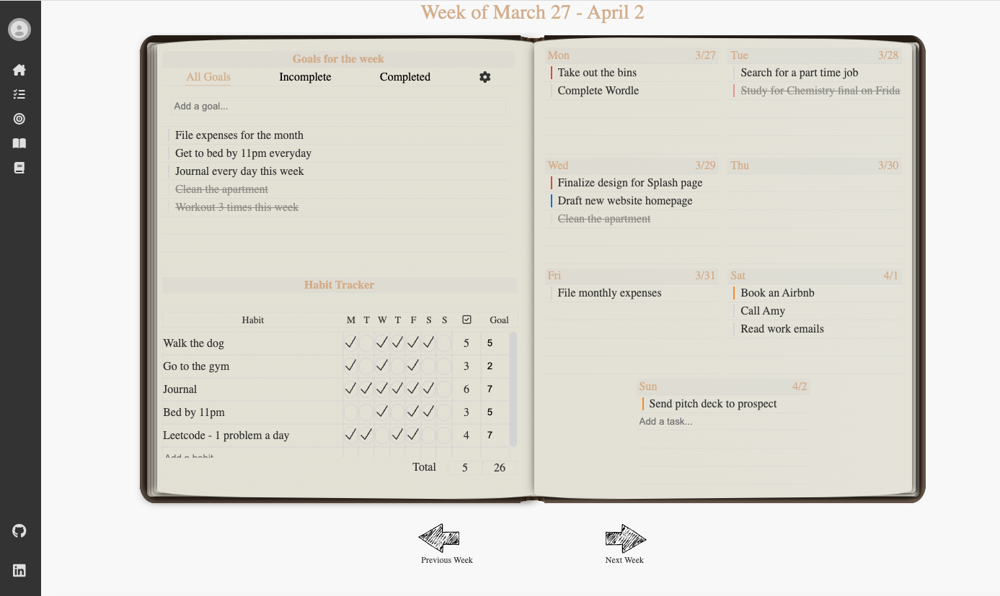
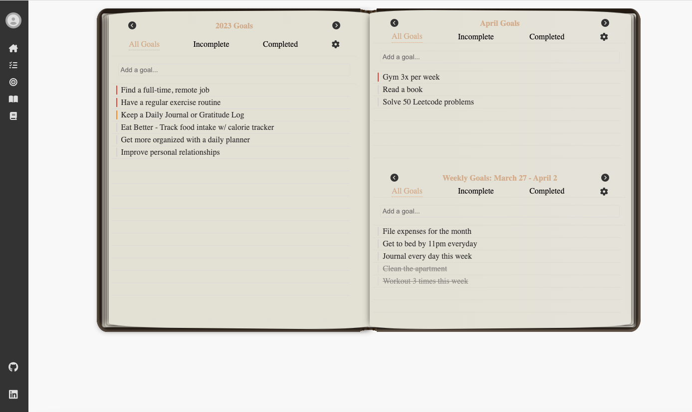
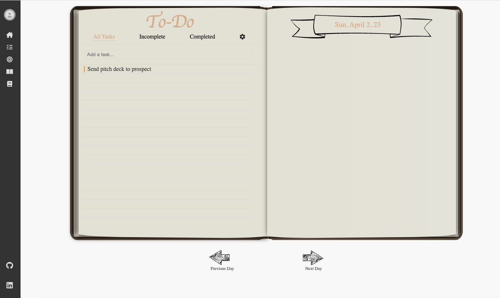
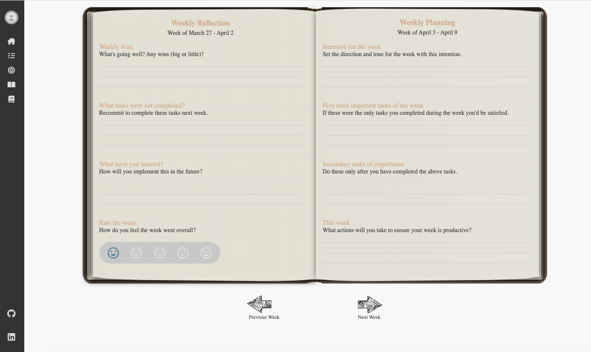

<h1 align='center'>Goale </h1>
<p align='center'>
- A virtual journaling app -
</p>
<p align='center'>- <a href='https://goal-e-thevirtualplanner.onrender.com' align='center'>Live Link</a> - </p>

<a name="readme-top"></a>

# About Goale

Goale, a virtual journaling app, is a comprehensive tool for tracking personal development and productivity. It includes features such as goal, task, and habit tracking to ensure users can stay on top of their progress and work towards their objectives. The app also allows users to add images, reflections, and notes, making it easy to capture thoughts and experiences for self-reflection and growth.

# Project Wiki:

- [Feature List](https://github.com/JAllen2022/Jason-Allen-Capstone-Repo/wiki/Feature-List)
- [Database Schema](https://github.com/JAllen2022/Jason-Allen-Capstone-Repo/wiki/Database-Schema)
- [User Stories](https://github.com/JAllen2022/Jason-Allen-Capstone-Repo/wiki/User-Stories)

# Tech Stack

## Frameworks, Platforms and Libraries used:


## Database


## Hosting:

[Render](https://render.com/)

# Landing Page

You can log-in, signup, and navigate to a page to search groups and events. There is a demo user feature so users do not have to sign up.

## Goal-e Splash Page



<p align="right">(<a href="#readme-top">back to top</a>)</p>

# Sign-up



<p align="right">(<a href="#readme-top">back to top</a>)</p>

# Log-in



<p align="right">(<a href="#readme-top">back to top</a>)</p>

# Weekly Planner



<p align="right">(<a href="#readme-top">back to top</a>)</p>

# Goal tracker



<p align="right">(<a href="#readme-top">back to top</a>)</p>

# Task Tracker



<p align="right">(<a href="#readme-top">back to top</a>)</p>

# Weekly Reflection



<p align="right">(<a href="#readme-top">back to top</a>)</p>

# Future Features

- Recurring Tasks
- Drag and drop functionality to order lists to a user's preferences
- Daily calendar to go along with daily task list
- Additional journal page options - including a workout log, food journal, etc.

<p align="right">(<a href="#readme-top">back to top</a>)</p>

# Get Started

## Getting Started

This is an example of how you may give instructions on setting up your project locally.
To get a local copy up and running follow these simple example steps.

## Installation

1. Clone this repository

2. Install dependencies

   ```bash
   pipenv install -r requirements.txt
   ```

3. Create a **.env** file based on the example with proper settings for your
   development environment

4. Make sure the SQLite3 database connection URL is in the **.env** file

5. This starter organizes all tables inside the `flask_schema` schema, defined
   by the `SCHEMA` environment variable. Replace the value for
   `SCHEMA` with a unique name, **making sure you use the snake_case
   convention**.

6. Get into your pipenv, migrate your database, seed your database, and run your Flask app

   ```bash
   pipenv shell
   ```

   ```bash
   flask db upgrade
   ```

   ```bash
   flask seed all
   ```

   ```bash
   flask run
   ```

7. To run the React App in development, checkout the [README](./react-app/README.md) inside the `react-app` directory.

<p align="right">(<a href="#readme-top">back to top</a>)</p>

# Contact

Jason Allen - jasonallen715@gmail.com

Project link - https://github.com/JAllen2022/API-project

<p align="right">(<a href="#readme-top">back to top</a>)</p>
